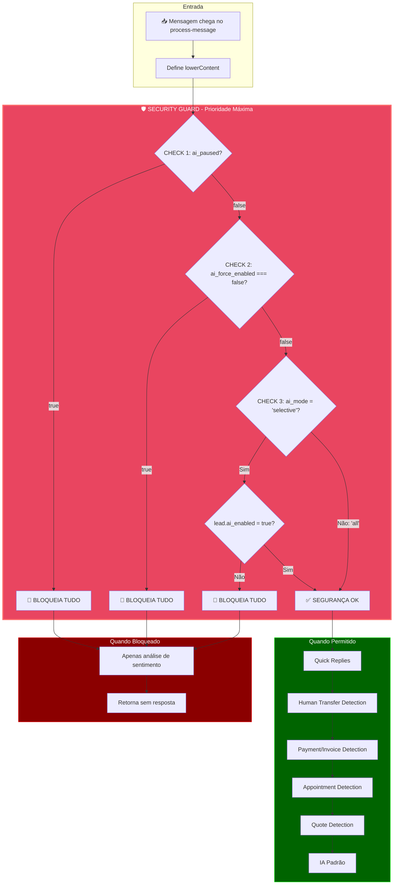
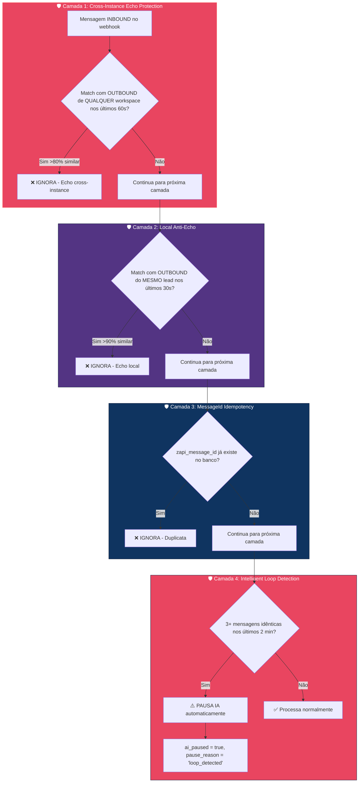
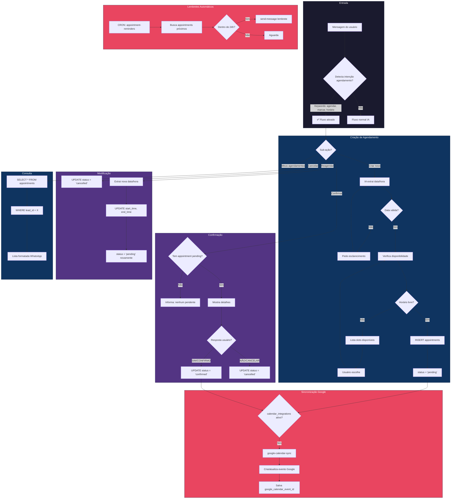
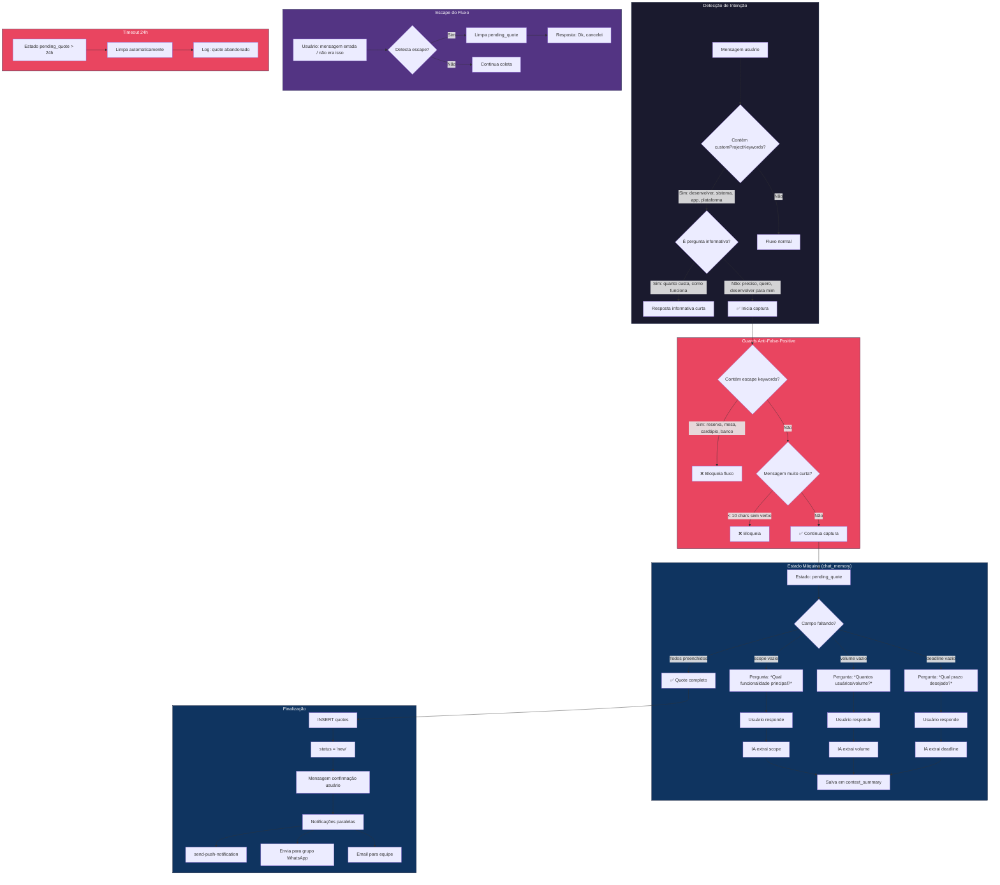
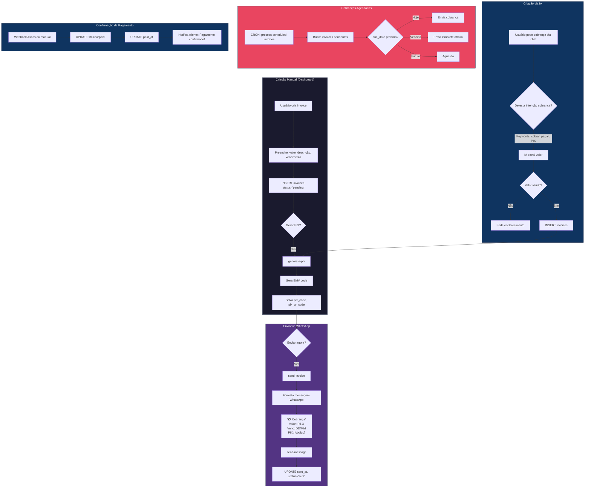
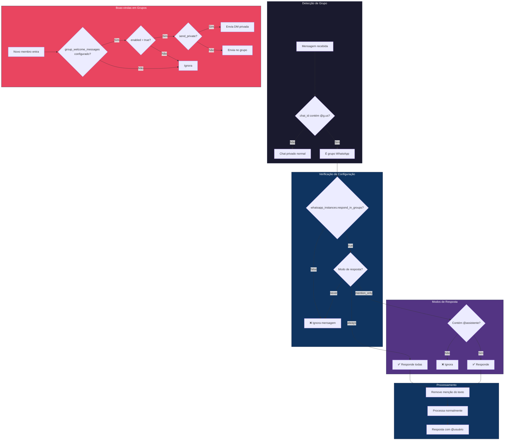
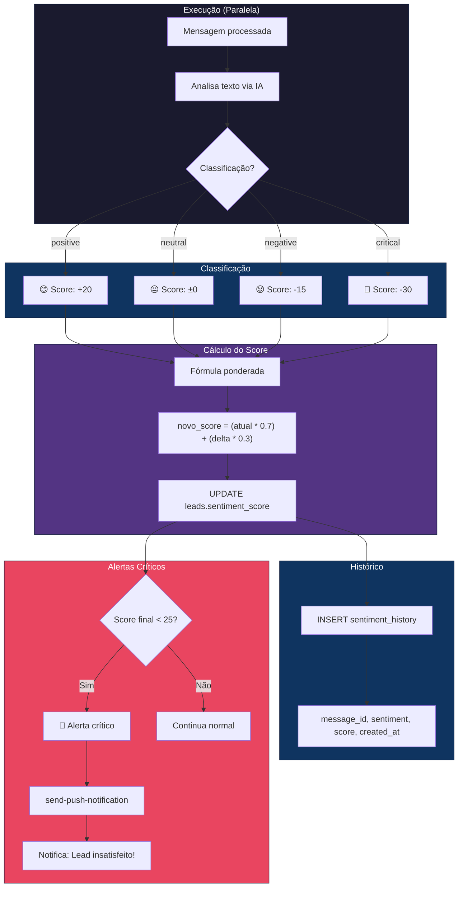
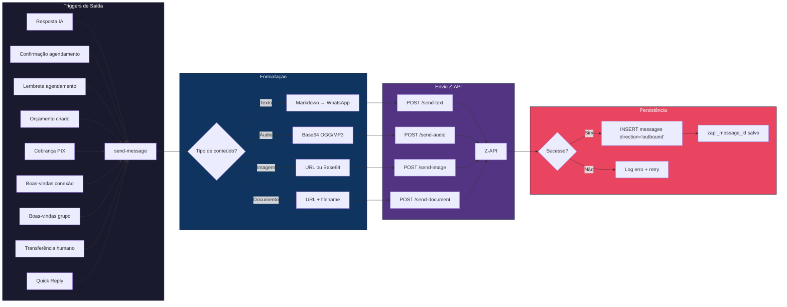

# Arquitetura de Processamento de Mensagens IA - Appi AutoZap

## Contexto da Plataforma

O **Appi AutoZap** é uma plataforma de atendimento automatizado via WhatsApp que utiliza Inteligência Artificial para responder clientes de forma personalizada. A plataforma permite que empresas configurem agentes de IA com personalidades distintas, bases de conhecimento específicas e comportamentos customizados.

### Componentes Principais

| Componente | Descrição |
|------------|-----------|
| **WhatsApp Instances** | Conexões com números de WhatsApp via Z-API |
| **Agentes/Templates** | Perfis de IA configuráveis (Vendas, Suporte, Agendamentos, etc.) |
| **Base de Conhecimento** | Documentos e informações que a IA utiliza para responder |
| **Sistema RAG** | Retrieval-Augmented Generation para busca semântica de conhecimento |
| **Buffer de Mensagens** | Sistema de agrupamento de mensagens consecutivas |
| **Estado de Conversa** | Máquina de estados para fluxos complexos (orçamentos, agendamentos) |
| **Security Guard** | Camada de segurança que bloqueia respostas automáticas quando necessário |

---

## 1. Diagrama Principal - Visão Geral Completa

```mermaid
flowchart TD
    subgraph ENTRADA["1️⃣ ENTRADA (zapi-webhook)"]
        A[📱 Mensagem WhatsApp] --> B{Token válido?}
        B -->|Não| C[❌ Rejeita 401]
        B -->|Sim| ANTI_ECHO{🛡️ Cross-Instance Echo?}
        ANTI_ECHO -->|Sim: match outbound 60s| IGNORE_ECHO[❌ Ignora echo]
        ANTI_ECHO -->|Não| D{Tipo de evento?}
        
        D -->|ConnectedCallback| E[🔗 Evento Conexão]
        E --> F[send-welcome-whatsapp]
        
        D -->|ReceivedCallback| G[📝 Mensagem Recebida]
        G --> H{É grupo?}
        H -->|Sim| I{respond_in_groups?}
        I -->|Não| J[❌ Ignora]
        I -->|Sim| K{Modo mention?}
        K -->|Sim + sem @| J
        K -->|Não ou com @| L[Continua]
        H -->|Não| L
        
        L --> M{Tipo de mídia?}
        M -->|Áudio| N[🎙️ transcribe-audio-base64]
        M -->|Imagem/Doc| O[💾 Salva metadata]
        M -->|Texto| P[📝 Texto direto]
        N --> Q[Buffer de mensagens]
        O --> Q
        P --> Q
        
        Q --> R{Buffer timeout?}
        R -->|Não| S[⏳ Aguarda 3-5s]
        S --> Q
        R -->|Sim| T[📤 process-message]
    end

    subgraph SECURITY["2️⃣ SECURITY GUARD (Prioridade Máxima)"]
        T --> SEC1{🛑 ai_paused?}
        SEC1 -->|Sim| SEC_BLOCK1[❌ BLOQUEIA TUDO]
        SEC1 -->|Não| SEC2{🛑 ai_force_enabled = false?}
        SEC2 -->|Sim| SEC_BLOCK2[❌ BLOQUEIA TUDO]
        SEC2 -->|Não| SEC3{🛑 selective + !ai_enabled?}
        SEC3 -->|Sim| SEC_BLOCK3[❌ BLOQUEIA TUDO]
        SEC3 -->|Não| SEC_PASS[✅ Segurança OK]
        
        SEC_BLOCK1 --> SENT_ONLY[⏸️ Apenas sentimento]
        SEC_BLOCK2 --> SENT_ONLY
        SEC_BLOCK3 --> SENT_ONLY
    end

    subgraph VALIDACAO["3️⃣ VALIDAÇÕES (process-message)"]
        SEC_PASS --> U{Instância conectada?}
        U -->|Não| V[❌ Log + ignora]
        U -->|Sim| W{Subscription ativa?}
        W -->|Não| X[❌ Log + ignora]
        W -->|Sim| AC[✅ Processa IA]
    end

    subgraph ROTEAMENTO["4️⃣ ROTEAMENTO DE AGENTES"]
        AC --> AD{Roteamento ativo?}
        AD -->|Não| AE[Template padrão]
        AD -->|Sim| AF{Modo roteamento?}
        AF -->|keywords| AG[🔤 Match trigger_keywords]
        AF -->|ai| AH[🤖 LLM classifica intenção]
        AG --> AI{Match encontrado?}
        AI -->|Sim| AJ[Template matched]
        AI -->|Não| AE
        AH --> AJ
        AE --> AK[Valida prompt]
        AJ --> AK
        AK --> AL{prompt >= 50 chars?}
        AL -->|Não| AM[⚠️ Prompt default seguro]
        AL -->|Sim| AN[✅ Usa prompt do template]
    end

    subgraph INTENCAO["5️⃣ DETECÇÃO DE INTENÇÃO"]
        AM --> AO[Analisa mensagem]
        AN --> AO
        AO --> AP{Intenção detectada?}
        
        AP -->|Transferir humano| AQ[🚨 FLUXO HUMANO]
        AP -->|Agendamento| AR[📅 FLUXO APPOINTMENTS]
        AP -->|Orçamento| AS[💼 FLUXO QUOTES]
        AP -->|Cobrança/PIX| AT[💳 FLUXO INVOICES]
        AP -->|Quick Reply match| QR[⚡ QUICK REPLY]
        AP -->|Consulta geral| AU[🤖 FLUXO IA PADRÃO]
    end

    subgraph FLUXO_HUMANO["6️⃣ TRANSFERÊNCIA HUMANA"]
        AQ --> AV[ai_paused = true]
        AV --> AW[pause_reason = 'user_request']
        AW --> AX[Mensagem transição]
        AX --> AY[send-push-notification]
        AY --> AZ[📤 Envia confirmação]
    end

    subgraph FLUXO_APPOINTMENTS["7️⃣ AGENDAMENTOS"]
        AR --> BA{Sub-intenção?}
        BA -->|Criar| BB[Extrai data/hora via IA]
        BA -->|Confirmar| BC[Keywords: SIM, CONFIRMO]
        BA -->|Cancelar| BD[Keywords: cancelar]
        BA -->|Reagendar| BE[Keywords: reagendar]
        BA -->|Consultar| BF[Keywords: meus agendamentos]
        
        BB --> BG{Horário disponível?}
        BG -->|Não| BH[Sugere slots livres]
        BG -->|Sim| BI[Cria appointment status=pending]
        BI --> BJ{Google Calendar ativo?}
        BJ -->|Sim| BK[google-calendar-sync]
        BJ -->|Não| BL[Apenas local]
        
        BC --> BM[status = confirmed]
        BD --> BN[status = cancelled]
        BE --> BO[Atualiza start_time/end_time]
        BF --> BP[Lista agendamentos do lead]
    end

    subgraph FLUXO_QUOTES["8️⃣ ORÇAMENTOS (Estado Máquina)"]
        AS --> CA{Estado atual?}
        CA -->|Novo| CB[Detecta customProjectKeywords]
        CB --> CC{É projeto software?}
        CC -->|Não| CD[Resposta normal]
        CC -->|Sim| CE[Estado: collecting_scope]
        
        CA -->|collecting_scope| CF[Pergunta: qual funcionalidade?]
        CF --> CG[Salva scope em chat_memory]
        CG --> CH[Estado: collecting_volume]
        
        CA -->|collecting_volume| CI[Pergunta: quantos usuários?]
        CI --> CJ[Salva volume]
        CJ --> CK[Estado: collecting_deadline]
        
        CA -->|collecting_deadline| CL[Pergunta: prazo desejado?]
        CL --> CM[Salva deadline]
        CM --> CN[Cria quote no banco]
        CN --> CO[Notifica equipe]
        CO --> CP[send-quote + push + email]
    end

    subgraph FLUXO_INVOICES["9️⃣ COBRANÇAS PIX"]
        AT --> DA{Ação?}
        DA -->|Gerar| DB[generate-pix EMV]
        DA -->|Enviar| DC[send-invoice]
        DA -->|Agendada| DD[process-scheduled-invoices]
        
        DB --> DE[Cria código PIX]
        DE --> DF[Salva em invoices]
        DC --> DG[Envia via WhatsApp]
        DD --> DH[Verifica due_date]
        DH --> DI[Envia lembretes automáticos]
    end

    subgraph FLUXO_IA["🔟 RESPOSTA IA PADRÃO"]
        AU --> EA[📚 RAG: Busca conhecimento]
        EA --> EB{Embedding OK?}
        EB -->|Timeout 5s| EC[Fallback: top 50 por prioridade]
        EB -->|Sucesso| ED[match_knowledge_base RPC]
        ED --> EE{Threshold > 0.4?}
        EE -->|Não| EC
        EE -->|Sim| EF[Itens relevantes]
        EC --> EG[Combina + reordena keywords]
        EF --> EG
        
        EG --> EH[🔧 Monta System Prompt]
        EH --> EI["Nível 1: 🔴 Regras de Ouro"]
        EI --> EJ["Nível 2: 🟡 Base de Conhecimento"]
        EJ --> EK["Nível 3: 🟢 Comportamento"]
        
        EK --> EL[📨 Lovable AI Gateway]
        EL --> EM{Resposta OK?}
        EM -->|429| EN[Retry backoff]
        EN --> EL
        EM -->|402/500| EO[❌ Erro logado]
        EM -->|200| EP[✅ Resposta gerada]
    end

    subgraph QUICK_REPLY["⚡ QUICK REPLIES"]
        QR --> QR1[Match trigger exato]
        QR1 --> QR2[Envia resposta configurada]
        QR2 --> GF
    end

    subgraph SENTIMENTO["1️⃣1️⃣ ANÁLISE DE SENTIMENTO (Paralelo)"]
        SENT_ONLY --> FA[Analisa mensagem]
        EP --> FA
        FA --> FB{Classificação?}
        FB -->|positive| FC[Score +20]
        FB -->|neutral| FD[Score ±0]
        FB -->|negative| FE[Score -15]
        FB -->|critical| FF[Score -30 + Alerta]
        
        FC --> FG[Atualiza sentiment_score]
        FD --> FG
        FE --> FG
        FF --> FG
        FG --> FH["Score = 70% atual + 30% novo"]
        FH --> FI{Score < 25?}
        FI -->|Sim| FJ[🚨 Alerta crítico]
        FI -->|Não| FK[Continua]
    end

    subgraph SAIDA["1️⃣2️⃣ PÓS-PROCESSAMENTO E SAÍDA"]
        EP --> GA[🔄 Markdown → WhatsApp]
        GA --> GB["**bold** → *bold*"]
        GB --> GC{Loop detectado?}
        GC -->|Sim 3x| GD[Resposta genérica]
        GC -->|Não| GE[Resposta final]
        
        GD --> GF[📤 send-message Z-API]
        GE --> GF
        AZ --> GF
        BL --> GF
        BK --> GF
        CP --> GF
        DG --> GF
        
        GF --> GG[💾 Salva em messages]
        GG --> GH[✅ Fim do fluxo]
    end

    style ENTRADA fill:#1a1a2e,stroke:#16213e,color:#fff
    style SECURITY fill:#e94560,stroke:#ff6b6b,color:#fff,stroke-width:3px
    style VALIDACAO fill:#1a1a2e,stroke:#16213e,color:#fff
    style ROTEAMENTO fill:#0f3460,stroke:#16213e,color:#fff
    style INTENCAO fill:#0f3460,stroke:#16213e,color:#fff
    style FLUXO_HUMANO fill:#e94560,stroke:#16213e,color:#fff
    style FLUXO_APPOINTMENTS fill:#533483,stroke:#16213e,color:#fff
    style FLUXO_QUOTES fill:#533483,stroke:#16213e,color:#fff
    style FLUXO_INVOICES fill:#533483,stroke:#16213e,color:#fff
    style FLUXO_IA fill:#0f3460,stroke:#16213e,color:#fff
    style QUICK_REPLY fill:#533483,stroke:#16213e,color:#fff
    style SENTIMENTO fill:#e94560,stroke:#16213e,color:#fff
    style SAIDA fill:#1a1a2e,stroke:#16213e,color:#fff
```



---

## 2. Security Guard Flow (CRÍTICO)

O Security Guard é a **primeira camada de verificação** que executa antes de qualquer resposta automática. Isso garante que controles como "Hands On" e "Modo Seletivo" bloqueiem **TODAS** as respostas, incluindo Quick Replies e mensagens de transferência humana.

### Diagrama de Prioridade



### Ordem de Verificações

```text
┌─────────────────────────────────────────────────────────────────────────────┐
│  🛡️ SECURITY GUARD (Executado PRIMEIRO em process-message)                 │
├─────────────────────────────────────────────────────────────────────────────┤
│  1️⃣ CHECK ai_paused (Hands On)                                             │
│     └─ Se TRUE → BLOQUEIA TUDO (nenhuma resposta automática)                │
│                                                                              │
│  2️⃣ CHECK ai_force_enabled                                                 │
│     └─ Se FALSE → BLOQUEIA TUDO                                             │
│                                                                              │
│  3️⃣ CHECK Modo Seletivo                                                    │
│     └─ Se ai_mode='selective' E lead.ai_enabled=false → BLOQUEIA TUDO       │
├─────────────────────────────────────────────────────────────────────────────┤
│  ✅ APÓS SECURITY GUARD (só executa se passou em todos os checks)           │
│  ├─ Quick Replies                                                            │
│  ├─ Human Transfer Keywords Detection                                        │
│  ├─ Payment/Invoice Detection                                                │
│  ├─ Appointment Detection                                                    │
│  ├─ Quote Detection                                                          │
│  └─ IA Padrão                                                                │
└─────────────────────────────────────────────────────────────────────────────┘
```

### Logs de Debug do Security Guard

Quando uma mensagem é bloqueada pelo Security Guard, os logs mostram:

```text
[process-message] 🛑 SECURITY BLOCK: AI paused (Hands On) for lead abc123
[process-message] 🛑 SECURITY BLOCK: ai_force_enabled is false for lead abc123
[process-message] 🛑 SECURITY BLOCK: Selective mode + AI not enabled for lead abc123
```

---

## 3. Variáveis de Controle de IA

Esta seção documenta todas as variáveis que controlam o comportamento da IA no sistema.

### Tabela de Variáveis

| Variável | Tabela | Tipo | Descrição | Efeito |
|----------|--------|------|-----------|--------|
| `ai_paused` | `chat_memory` | boolean | Hands On - pausa manual da IA por lead | **BLOQUEIA TODAS as respostas automáticas** |
| `ai_force_enabled` | `chat_memory` | boolean \| null | Override forçado do estado da IA | Se `false`, **BLOQUEIA todas as respostas** |
| `pause_reason` | `chat_memory` | string \| null | Motivo da pausa | `'user_request'`, `'loop_detected'`, etc. |
| `paused_at` | `chat_memory` | timestamp | Data/hora da pausa | Para auditoria |
| `paused_by` | `chat_memory` | uuid \| null | ID do usuário que pausou | Para auditoria |
| `ai_enabled` | `leads` | boolean | Habilitação de IA por lead | Usado em **modo seletivo** |
| `ai_mode` | `whatsapp_instances` | string | Modo da instância | `'all'` ou `'selective'` |
| `respond_in_groups` | `whatsapp_instances` | boolean | Se IA responde em grupos | Bloqueia grupos se `false` |
| `group_response_mode` | `whatsapp_instances` | string | Modo de resposta em grupos | `'always'` ou `'mention_only'` |

### Hierarquia de Precedência

```text
1. ai_paused = true          → BLOQUEIA (mais alta prioridade)
2. ai_force_enabled = false  → BLOQUEIA
3. selective + !ai_enabled   → BLOQUEIA
4. respond_in_groups = false → BLOQUEIA (apenas grupos)
5. mention_only + sem @      → BLOQUEIA (apenas grupos)
6. Nenhum bloqueio           → IA RESPONDE
```

### Cenários de Uso

| Cenário | ai_paused | ai_force_enabled | ai_mode | ai_enabled | Resultado |
|---------|-----------|------------------|---------|------------|-----------|
| Hands On ativo | `true` | - | - | - | ❌ Bloqueado |
| Override desativado | `false` | `false` | - | - | ❌ Bloqueado |
| Seletivo, IA desabilitada | `false` | `true` | `selective` | `false` | ❌ Bloqueado |
| Seletivo, IA habilitada | `false` | `true` | `selective` | `true` | ✅ Responde |
| Modo all, qualquer lead | `false` | `true` | `all` | - | ✅ Responde |

---

## 4. Proteção Anti-Echo (4 Camadas)

O sistema possui 4 camadas de proteção contra loops e mensagens duplicadas:

### Diagrama das 4 Camadas



### Detalhes de Cada Camada

#### Camada 1: Cross-Instance Echo Protection (zapi-webhook)

**Problema resolvido:** Quando workspace A envia mensagem para um número que também é monitorado pelo workspace B, a Z-API notifica ambas as instâncias.

**Solução:**
```typescript
// No zapi-webhook, antes de processar:
const { data: recentEcho } = await supabase
  .from('messages')
  .select('id')
  .eq('direction', 'outbound')
  .gte('created_at', new Date(Date.now() - 60000).toISOString())
  .ilike('content', `%${content.substring(0, 80)}%`)
  .limit(1);

if (recentEcho?.length > 0) {
  console.log('[zapi-webhook] CROSS_INSTANCE_ECHO detected, ignoring');
  return; // Ignora silenciosamente
}
```

#### Camada 2: Local Anti-Echo (process-message)

**Problema resolvido:** A IA pode "ouvir" suas próprias mensagens e entrar em loop.

**Solução:**
- Verifica se existe mensagem OUTBOUND com >90% de similaridade
- Para o mesmo lead_id
- Nos últimos 30 segundos
- Se existe, ignora a mensagem

#### Camada 3: MessageId Idempotency

**Problema resolvido:** Z-API pode enviar a mesma mensagem múltiplas vezes via webhook.

**Solução:**
- Campo `zapi_message_id` na tabela `messages`
- Antes de inserir, verifica se já existe
- Se existe, ignora (idempotência)

#### Camada 4: Intelligent Loop Detection

**Problema resolvido:** Cliente e IA entram em loop de respostas repetitivas.

**Solução:**
- Detecta se 3+ mensagens com conteúdo idêntico foram enviadas em 2 minutos
- Se detectado:
  - Define `ai_paused = true`
  - Define `pause_reason = 'loop_detected'`
  - Para de responder automaticamente
  - Envia notificação para equipe

### Logs de Debug Anti-Echo

```text
[zapi-webhook] CROSS_INSTANCE_ECHO: Ignoring message matching recent outbound
[process-message] ANTI_ECHO_LOCAL: Message matches recent outbound for same lead
[process-message] IDEMPOTENCY: Message with zapi_message_id already processed
[process-message] LOOP_DETECTED: 3+ identical messages in 2 minutes, pausing AI
```

---

## 5. Fluxos Detalhados

### 5.1 Fluxo de Agendamentos (Appointments)



**Tabelas envolvidas:**
- `appointments`: id, lead_id, workspace_id, title, start_time, end_time, status, google_calendar_event_id
- `calendar_integrations`: credentials, calendar_id, is_active
- `leads`: phone, name (para personalização)

**Edge Functions:**
- `process-message`: Detecção de intenção e criação
- `appointment-reminders`: CRON para lembretes
- `google-calendar-sync`: Sincronização bidirecional

---

### 5.2 Fluxo de Orçamentos (Quotes) - Estado Máquina



**Tabelas envolvidas:**
- `chat_memory`: context_summary (JSON com pending_quote, scope, volume, deadline)
- `quotes`: id, lead_id, workspace_id, title, description, total_value, status
- `leads`: phone, name

**Keywords de ativação (customProjectKeywords):**
```javascript
['desenvolver', 'sistema', 'aplicativo', 'app', 'plataforma', 'software', 'site', 'loja virtual']
```

**Keywords de bloqueio (serviceKeywords):**
```javascript
['reserva', 'mesa', 'restaurante', 'cardápio', 'banco', 'conta']
```

---

### 5.3 Fluxo de Cobranças (Invoices)



**Tabelas envolvidas:**
- `invoices`: id, lead_id, workspace_id, amount, description, due_date, status, pix_code, pix_qr_code, sent_at, paid_at
- `pix_config`: pix_key, pix_key_type, receiver_name, receiver_city (configuração EMV)
- `leads`: phone (para envio)

**Edge Functions:**
- `generate-pix`: Gera código EMV PIX estático
- `send-invoice`: Envia cobrança formatada via WhatsApp
- `process-scheduled-invoices`: CRON para cobranças agendadas

---

### 5.4 Fluxo de Grupos WhatsApp



**Tabelas envolvidas:**
- `whatsapp_instances`: respond_in_groups (boolean), group_response_mode
- `group_welcome_messages`: group_phone, message, send_private, enabled, delay_seconds

---

### 5.5 Fluxo de Transferência para Humano

**IMPORTANTE:** O Security Guard verifica `ai_paused` ANTES de detectar keywords de transferência. Se `ai_paused = true`, nenhuma resposta é enviada (nem a mensagem de transferência).

```mermaid
flowchart TD
    subgraph SECURITY["🛡️ Security Guard (Primeiro)"]
        A[Mensagem usuário] --> B{ai_paused = true?}
        B -->|Sim| C[❌ BLOQUEIA - Nenhuma resposta]
        B -->|Não| D[Continua verificações]
    end

    subgraph DETECCAO["Detecção"]
        D --> E{Contém keywords?}
        E -->|atendente, humano, pessoa real, falar com alguém| F[✅ Transferência solicitada]
        E -->|Não| G[Continua IA]
    end

    subgraph EXECUCAO["Execução"]
        F --> H[UPDATE chat_memory]
        H --> I[ai_paused = true]
        I --> J[pause_reason = 'user_request']
        J --> K[paused_at = now()]
    end

    subgraph NOTIFICACAO["Notificações"]
        K --> L[Mensagem ao usuário]
        L --> M["*Um momento!* Estou transferindo para um atendente humano..."]
        M --> N[send-push-notification]
        N --> O[Notifica equipe: Lead X pediu atendente]
    end

    subgraph RETOMADA["Retomada da IA"]
        P[Operador finaliza atendimento] --> Q{Reativar IA?}
        Q -->|Sim| R[UPDATE ai_paused = false]
        Q -->|Não| S[Mantém pausado]
    end

    style SECURITY fill:#e94560,stroke:#ff6b6b,color:#fff,stroke-width:3px
    style DETECCAO fill:#1a1a2e,stroke:#16213e,color:#fff
    style EXECUCAO fill:#e94560,stroke:#16213e,color:#fff
    style NOTIFICACAO fill:#0f3460,stroke:#16213e,color:#fff
    style RETOMADA fill:#533483,stroke:#16213e,color:#fff
```

**Keywords de transferência:**
```javascript
['atendente', 'humano', 'pessoa', 'pessoa real', 'falar com alguém', 'operador', 'suporte humano']
```

---

### 5.6 Fluxo de Análise de Sentimento



**Observação importante:** A análise de sentimento executa **mesmo quando a IA está pausada** (`ai_paused = true`), pois é uma métrica de monitoramento independente.

---

### 5.7 Integrações Externas

```mermaid
flowchart TD
    subgraph GOOGLE["Google Calendar"]
        A[Appointment criado/atualizado] --> B{calendar_integrations.is_active?}
        B -->|Sim| C[google-calendar-sync]
        C --> D[OAuth2 refresh token]
        D --> E[Google Calendar API]
        E --> F[Cria/atualiza evento]
        F --> G[Salva google_calendar_event_id]
    end

    subgraph APOLLO["Apollo.io (Prospecção)"]
        H[Usuário busca prospects] --> I[apollo-search]
        I --> J[API Apollo: filtros]
        J --> K[Retorna lista pessoas]
        K --> L{Enriquecer?}
        L -->|Sim| M[apollo-enrich]
        M --> N[Dados completos + telefone]
        N --> O[Cria lead no sistema]
    end

    subgraph ASAAS["Asaas (Pagamentos)"]
        P[Cobrança criada] --> Q{Usar Asaas?}
        Q -->|Sim| R[asaas-payments]
        R --> S[Cria cobrança Asaas]
        S --> T[Retorna link pagamento]
        
        U[Webhook Asaas] --> V[asaas-webhook]
        V --> W{Evento?}
        W -->|PAYMENT_CONFIRMED| X[UPDATE invoice status='paid']
        W -->|PAYMENT_OVERDUE| Y[UPDATE invoice status='overdue']
    end

    style GOOGLE fill:#0f3460,stroke:#16213e,color:#fff
    style APOLLO fill:#533483,stroke:#16213e,color:#fff
    style ASAAS fill:#e94560,stroke:#16213e,color:#fff
```



---

### 5.8 Estrutura Hierárquica do System Prompt

O system prompt da IA segue uma estrutura de 3 níveis de prioridade, garantindo que regras críticas sejam sempre respeitadas:

```text
┌─────────────────────────────────────────────────────────────┐
│  🔴 NÍVEL 1 - REGRAS DE OURO (Prioridade Máxima)           │
│  ├─ Identidade do agente                                    │
│  ├─ Regra fundamental de precisão                           │
│  ├─ Checklist de verificação                                │
│  ├─ Categorias que exigem verificação                       │
│  ├─ Frases de Escape                                        │
│  ├─ Terminologia obrigatória                                │
│  └─ Proibições absolutas                                    │
├─────────────────────────────────────────────────────────────┤
│  🟡 NÍVEL 2 - BASE DE CONHECIMENTO (Prioridade Alta)       │
│  ├─ Cabeçalho: "SUA ÚNICA FONTE DE VERDADE"                │
│  ├─ Itens agrupados por categoria                           │
│  └─ Lembrete: usar Frase de Escape se não encontrar        │
├─────────────────────────────────────────────────────────────┤
│  🟢 NÍVEL 3 - COMPORTAMENTO (Prioridade Normal)            │
│  ├─ Fluxo conversacional                                    │
│  ├─ Formatação WhatsApp                                     │
│  ├─ Tamanho de respostas (máx 200 palavras)                │
│  └─ Personalidade (tom, verbosidade)                        │
└─────────────────────────────────────────────────────────────┘
```

#### Frases de Escape (Anti-Alucinação)

Quando a informação não está na Base de Conhecimento, a IA usa frases específicas:

| Contexto | Frase de Escape |
|----------|-----------------|
| Preços/Valores | "Esse valor específico preciso confirmar com nossa equipe. Posso anotar seu contato?" |
| Prazos/Disponibilidade | "Para te dar uma data precisa, preciso verificar. Me permite um momento?" |
| Funcionalidades | "Vou confirmar essa informação com nosso time. Posso retornar com a resposta certa?" |
| Localização/Entrega | "Vou verificar se atendemos essa região e te retorno, ok?" |
| Geral | "Ótima pergunta! Deixa eu confirmar essa informação para te responder com certeza." |
| Atendente Humano | "Claro! Vou te transferir para um de nossos atendentes. Um momento..." |

#### Regras de Comportamento

| Regra | Descrição |
|-------|-----------|
| Apresentação | Apenas na primeira mensagem (sem histórico) |
| Nome do cliente | Máximo 1x a cada 3 mensagens |
| Tamanho | Perguntas simples: 1-2 frases / Explicações: 3-4 frases / Máximo: 200 palavras |
| Formatação | Negrito: `*texto*` / Emojis: máx 2 / Preferir texto corrido |
| Agendamentos | Sempre confirmar data E hora explícitos |
| Áudios | Responder ao conteúdo, não mencionar que é áudio |

---

## 6. Fluxos de Saída WhatsApp



### Mensagens de Saída por Tipo

| Trigger | Edge Function | Template de Mensagem |
|---------|---------------|----------------------|
| Resposta IA | `send-message` | Dinâmico (IA gera) |
| Quick Reply | `send-message` | Configurado pelo usuário |
| Confirmação agendamento | `process-message` | "✅ *Agendamento confirmado!* Dia X às Y" |
| Lembrete agendamento | `appointment-reminders` | "⏰ *Lembrete:* Você tem um agendamento amanhã às X" |
| Orçamento criado | `send-quote` | "📋 *Orçamento #X*\n\nDescrição: ...\nValor: R$ Y" |
| Cobrança PIX | `send-invoice` | "💳 *Cobrança*\n\nValor: R$ X\nVencimento: DD/MM\n\n*PIX Copia e Cola:*\n`código`" |
| Boas-vindas conexão | `send-welcome-whatsapp` | Configurável por workspace |
| Transferência humano | `process-message` | "👋 *Um momento!* Estou transferindo para um atendente..." |

---

## 7. Referência Técnica

### Edge Functions

| Função | Responsabilidade | JWT | Tabelas |
|--------|------------------|-----|---------|
| `zapi-webhook` | Entrada de mensagens, buffer, eventos conexão, **anti-echo cross-instance** | ❌ | messages, message_buffer, leads, whatsapp_instances |
| `process-message` | **Security Guard**, processamento principal, IA, fluxos especiais | ❌ | messages, chat_memory, leads, appointments, quotes, custom_templates |
| `send-message` | Envio de mensagens via Z-API | ❌ | messages |
| `send-quote` | Envio de orçamentos via WhatsApp | ❌ | quotes, leads, messages |
| `send-invoice` | Envio de cobranças PIX via WhatsApp | ❌ | invoices, leads, messages |
| `generate-pix` | Geração de código EMV PIX | ❌ | pix_config, invoices |
| `appointment-reminders` | Lembretes automáticos (CRON) | ❌ | appointments, leads |
| `google-calendar-sync` | Sincronização com Google Calendar | ❌ | appointments, calendar_integrations |
| `apollo-search` | Busca de prospects | ❌ | - |
| `apollo-enrich` | Enriquecimento de dados | ❌ | leads, apollo_phone_reveals |
| `asaas-payments` | Integração pagamentos Asaas | ❌ | invoices, asaas_customers |
| `asaas-webhook` | Webhook de eventos Asaas | ❌ | invoices, payments_history |
| `send-welcome-whatsapp` | Mensagens de boas-vindas | ❌ | whatsapp_instances, leads |
| `send-push-notification` | Notificações push para equipe | ❌ | - |
| `transcribe-audio-base64` | Transcrição de áudio via Whisper | ❌ | - |
| `generate-embedding` | Geração de embeddings para RAG | ❌ | knowledge_base |
| `process-scheduled-invoices` | Cobranças agendadas (CRON) | ❌ | invoices, leads |

### Tabelas do Banco

| Tabela | Campos Principais | Uso |
|--------|-------------------|-----|
| `messages` | id, chat_id, lead_id, content, direction, message_type, sentiment, zapi_message_id | Histórico completo de mensagens |
| `message_buffer` | chat_id, content, buffer_started_at, expires_at, is_processed | Agrupamento de mensagens |
| `leads` | id, phone, name, sentiment_score, **ai_enabled**, status, whatsapp_instance_id | Contatos e configurações |
| `appointments` | id, lead_id, title, start_time, end_time, status, google_calendar_event_id | Agendamentos |
| `quotes` | id, lead_id, title, description, total_value, status | Orçamentos/Propostas |
| `invoices` | id, lead_id, amount, due_date, status, pix_code, pix_qr_code, sent_at, paid_at | Cobranças PIX |
| `chat_memory` | chat_id, lead_id, workspace_id, **ai_paused**, **ai_force_enabled**, **pause_reason**, **paused_at**, **paused_by**, context_summary, current_agent_id, agent_history | Estado de conversa e controles de IA |
| `knowledge_base` | id, title, content, embedding, keywords, priority, agent_ids | Base de conhecimento RAG |
| `custom_templates` | id, name, config (prompt), trigger_keywords, trigger_intents, priority | Agentes de IA |
| `agent_routing_config` | workspace_id, is_routing_enabled, routing_mode, default_agent_id | Configuração de roteamento |
| `calendar_integrations` | workspace_id, provider, credentials, is_active | Integrações de calendário |
| `pix_config` | workspace_id, pix_key, pix_key_type, receiver_name, receiver_city | Configuração PIX |
| `whatsapp_instances` | id, workspace_id, instance_id, token, status, respond_in_groups, **ai_mode**, group_response_mode | Instâncias WhatsApp |
| `group_welcome_messages` | workspace_id, group_phone, message, send_private, enabled | Boas-vindas em grupos |

### Secrets/Variáveis de Ambiente

| Secret | Uso |
|--------|-----|
| `ZAPI_CLIENT_TOKEN` | Autenticação Z-API |
| `OPENAI_API_KEY` | Whisper (transcrição) + Embeddings |
| `GOOGLE_CLIENT_ID` | OAuth Google Calendar |
| `GOOGLE_CLIENT_SECRET` | OAuth Google Calendar |
| `APOLLO_API_KEY` | API Apollo.io |
| `ASAAS_API_KEY` | API Asaas pagamentos |
| `ASAAS_WEBHOOK_TOKEN` | Validação webhook Asaas |

---

## 8. Pontos de Risco

### ✅ Corrigidos (Janeiro/2026)

| Risco | Status | Descrição | Correção |
|-------|--------|-----------|----------|
| **Ordem de verificações** | ✅ CORRIGIDO | `ai_paused` era verificado depois de quick replies, permitindo respostas indevidas | Security Guard Flow implementado - verificações de segurança agora são PRIMEIRAS |
| **Cross-Instance Echo** | ✅ CORRIGIDO | IA de workspace A respondia mensagens enviadas pelo workspace B para mesmo número | Anti-echo global no zapi-webhook verifica OUTBOUND de qualquer workspace |
| **Keyword Detection Falso** | ✅ CORRIGIDO | Detectava "atendente" em mensagens de outros workspaces | Security Guard bloqueia antes de detectar keywords |

### 🔴 Crítico

| Risco | Descrição | Mitigação |
|-------|-----------|-----------|
| **Fallback RAG** | Se busca semântica falha (timeout 5s), puxa 50 itens aleatórios por prioridade | Implementar cache de embeddings |
| **Memória Limitada** | Apenas 10 últimas mensagens de contexto | Adicionar resumo de conversa anterior |
| **Sem Validação Pós-IA** | Não verifica se resposta contradiz KB | Criar checker de consistência |
| **Estado Quote Perdido** | Se chat_memory corrompido, perde estado máquina | Timeout 24h já implementado |

### 🟡 Moderado

| Risco | Descrição | Mitigação |
|-------|-----------|-----------|
| **Prompt Default** | Se agente tem prompt < 50 chars, usa genérico | Forçar prompt mínimo no cadastro |
| **Timeout Embedding** | 5s pode ser pouco para textos longos | Aumentar timeout ou usar cache |
| **Conflito Agendamento** | IA pode criar duplicatas se usuário insiste | Validar conflitos antes de INSERT |

### 🟢 Baixo

| Risco | Descrição | Mitigação |
|-------|-----------|-----------|
| **Rate Limit** | 429 do gateway | Já tem retry com backoff |
| **Formato WhatsApp** | Conversão Markdown pode falhar | Regex bem testado |
| **Buffer Órfão** | Mensagem pode ficar presa no buffer | CRON process-orphan-buffers |

---

## 9. Fluxo de Debug

Para debugar problemas no processamento de mensagens:

### Verificações Primárias

1. **Verificar Security Guard:** Logs de `process-message` com `🛑 SECURITY BLOCK`
   - Se aparecer, a IA foi bloqueada corretamente por Hands On ou Modo Seletivo
   
2. **Verificar Cross-Instance Echo:** Logs de `zapi-webhook` com `CROSS_INSTANCE_ECHO`
   - Se aparecer, a mensagem foi ignorada por ser echo de outro workspace

### Verificações Secundárias

3. **Verificar chegada no webhook:** Logs de `zapi-webhook`
4. **Verificar buffer:** Tabela `message_buffer` (is_processed, expires_at)
5. **Verificar validações:** Logs de `process-message` (instância, subscription)
6. **Verificar roteamento:** `agent_routing_config`, `custom_templates`
7. **Verificar RAG:** `knowledge_base` (embedding_status, priority)
8. **Verificar envio:** Logs Z-API response, tabela `messages`

### Checklist de Debug para "IA não deveria ter respondido"

```text
□ 1. Verificar ai_paused no chat_memory do lead
□ 2. Verificar ai_force_enabled no chat_memory
□ 3. Verificar ai_mode na whatsapp_instance (all/selective)
□ 4. Se selective, verificar ai_enabled no lead
□ 5. Verificar logs do Security Guard no process-message
□ 6. Verificar logs do Anti-Echo no zapi-webhook
□ 7. Verificar se a mensagem era de outro workspace (cross-instance)
```

### Checklist de Debug para "IA deveria ter respondido mas não respondeu"

```text
□ 1. Verificar se ai_paused = false
□ 2. Verificar se ai_force_enabled != false
□ 3. Verificar subscription ativa do workspace
□ 4. Verificar instância conectada
□ 5. Verificar se mensagem não foi marcada como echo
□ 6. Verificar buffer - mensagem pode estar aguardando
□ 7. Verificar rate limit (429) nos logs
```

---

*Documentação atualizada em: Janeiro/2026*
*Versão: 2.2*

**Changelog v2.2:**
- Adicionado Security Guard Flow com verificações prioritárias
- Documentadas todas as variáveis de controle de IA (ai_paused, ai_force_enabled, ai_enabled, ai_mode)
- Adicionada seção completa de Proteção Anti-Echo (4 camadas)
- Atualizado diagrama principal com Security Guard destacado
- Atualizado fluxo de Transferência Humana mostrando Security Guard primeiro
- Adicionados pontos de risco corrigidos (ordem de verificações, cross-instance echo)
- Atualizada tabela de campos do banco com novos campos do chat_memory
- Expandido fluxo de debug com checklists específicos
